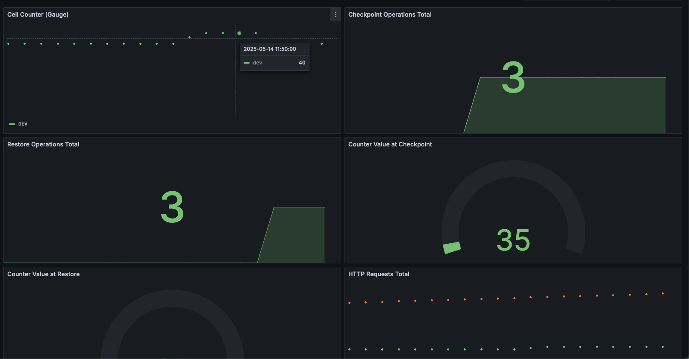

# Application Flask avec métriques Prometheus et dashboard Grafana

Ce projet est une application Flask instrumentée avec des métriques Prometheus, incluant des compteurs et gauges personnalisés pour les opérations de checkpoint et de restauration. Le tout est déployé avec Docker Compose, incluant Prometheus et Grafana pour la surveillance et la visualisation.

---

## Fonctionnalités

- Application Flask avec un compteur pouvant être checkpointé et restauré.
- Métriques Prometheus comprenant :
  - Gauge pour la valeur actuelle du compteur (`cell_counter`).
  - Compteurs pour les opérations de checkpoint et de restauration.
  - Gauges pour les valeurs du compteur lors des checkpoints et restaurations.
  - Métriques HTTP : nombre total de requêtes, erreurs, et histogramme de latence.
- Dashboard Grafana préconfiguré pour visualiser toutes les métriques.
- Configuration Docker Compose pour un déploiement simple de l’application, Prometheus et Grafana.

---

## Prérequis

- Docker
- Docker Compose

---

## Démarrage rapide

1. **Cloner le dépôt**

```bash
git clone https://github.com/nabilainas/monitoring-app.git
cd monitoring-app
```

1. **Cloner le dépôt**

```bash
docker-compose up --build
```

3. **Accéder aux services**

   - Application Flask : [http://localhost:8080](http://localhost:8080)
   - Prometheus : [http://localhost:9090](http://localhost:9090)
   - Grafana : [http://localhost:3000](http://localhost:3000)

4. **Connexion à Grafana**

   - Identifiant : `admin`
   - Mot de passe : `admin` (modifiable dans `docker-compose.yml`)

5. **Dashboard**

   Le dashboard "Flask App Metrics Dashboard" est chargé automatiquement via le provisioning et affiche :

   - La valeur actuelle du compteur.
   - Le nombre d’opérations checkpoint et restore.
   - Les valeurs du compteur lors des checkpoints et restores.
   - Les requêtes HTTP totales et erreurs.
   - La latence des requêtes (95e percentile).

6. **Testing Endpoints**

Afin d'ajouter des données au compteur on peut lancer :
```bash
curl http://localhost:8080/
```
On aura des réponses type:
```json
{"counter":35}
```

On peut ensuite créer un checkpoint avec :
```bash
curl -s -X POST http://localhost:8080/checkpoint
```
On aura une réponses type:
```json
{"counter":35,"status":"checkpoint saved"}
```

On a ensuite la possibilité de faire un restore avec:
```bash
curl -s -X POST http://localhost:8080/restore
```
On aura une réponses type:
```json
{"counter":35,"status":"restored"}
```

## Dashboard 



---

## Endpoints API

- `GET /`  
  Incrémente le compteur et retourne sa valeur actuelle.

- `POST /checkpoint`  
  Sauvegarde la valeur actuelle du compteur dans un fichier checkpoint et met à jour les métriques.

- `POST /restore`  
  Restaure la valeur du compteur depuis le fichier checkpoint et met à jour les métriques.

- `GET /metrics`  
  Expose les métriques Prometheus.

---

## Configuration

- Variables d’environnement :

  - `ENVIRONMENT` (par défaut : `dev`)  
    Utilisée comme label dans les métriques Prometheus pour différencier les environnements.

  - `CHECKPOINT_PATH` (par défaut : `/data/checkpoint.json`)  
    Chemin du fichier pour sauvegarder/restaurer le checkpoint du compteur.

- La configuration Prometheus se trouve dans `prometheus/prometheus.yml`.

- Les fichiers de provisioning Grafana sont dans `grafana/provisioning/`.

- Les dashboards Grafana sont dans `grafana/dashboards/`.

---

## Structure des fichiers

```
.
├── app.py                  # Code de l’application Flask
├── Dockerfile              # Dockerfile pour l’application Flask
├── requirements.txt        # Dépendances Python
├── docker-compose.yml      # Configuration Docker Compose
├── prometheus/
│   └── prometheus.yml      # Configuration de scrape Prometheus
└── grafana/
    ├── provisioning/
    │   ├── dashboards/
    │   │   └── dashboards.yaml
    │   └── datasources/
    │       └── datasource.yaml
    └── dashboards/
        └── flask_app_dashboard.json
```

---

## Remarques

- Assurez-vous que les dossiers `grafana/dashboards` et `grafana/provisioning` ont les permissions nécessaires pour que Grafana puisse les lire.

- Vous pouvez modifier le JSON du dashboard ou les requêtes Prometheus selon vos besoins de monitoring.

- Le fichier de checkpoint est persistant via un volume Docker (`./data`), ce qui permet de conserver l’état du compteur même après redémarrage des conteneurs.

---

## Contact

Pour toute question ou support, veuillez contacter nblainas@gmail.com